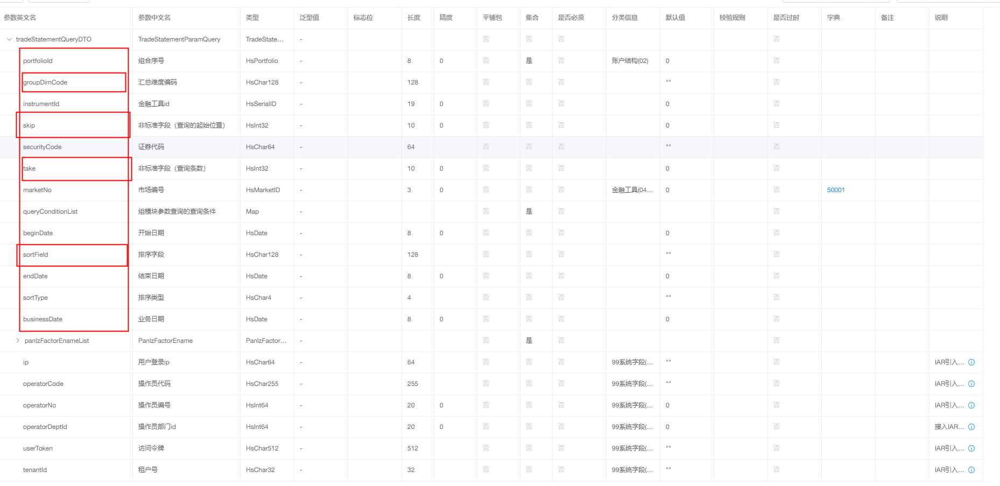
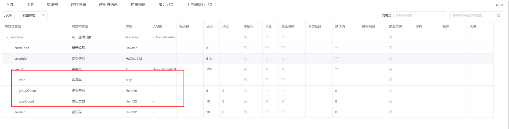

## 使用经验与优化

> ​ 本章节讲述一些使用过程中的经验，希望能够为大家提供一些解决问题的思路。但这只是前期解决问题时形成的一种方法，有其局限性。希望能够集思广益，结合业务需求和组件基础，多思考探索，在业务开发时使用更合适的解决方案。

### 将 loadOptions 处理成数据请求

​ 前面介绍了 CustomStore 中的 load 函数，入参 loadOptions 的具体属性依赖表格设置。以`remoteOperations: { groupPaging: true }`为例，通过上一章节的介绍，我们知道这样设置时，所有操作都由服务端进行数据处理。

```javascript
//...远程操作设置如下，且表格对应操作功能都开启时，
DxDataGrid.configs.remoteOperations = { groupPaging: true };
//... loadOptions如下所示，会包含以下属性，在不同操作时有差异
// *** 我们在load函数中要做的，就是根据这些属性，处理好数据，响应表格当前触发的操作
new DataSource({
  store: new CustomStore({
    loadMode: "processed",
    load: (loadOptions) => {
      // loadOptions
      const {
        filter,
        group,
        requireTotalCount,
        //...
        skip,
        sort,
        take,
        totalSummary,
      } = loadOptions;
      //... data process
      return {
        data: [],
        //...
      };
    },
  }),
});
```

​ 根据 loadOptions 中的属性返回表格所需的数据对象。返回的数据对象中必须包含 data<Array>属性，其他属性则根据入参 loadOptions 的属性值来决定。

```js
// ...
load: (loadOptions) => {
  const {
    requireTotalCount,
    //...
    totalSummary,
  } = loadOptions;
  const result = {
    data: [], //必须
  };
  if (totalSummary && totalSummary.length) {
    // 存在totalSummary<Array>时，返回值中需要包含summary属性
    // 根据totalSummary中的对象{selector: '${dataField}', summaryType: 'sum'}selector字段有序返回对应值
    // totalSummary = [{selector: 'count', summaryType:'count' },{selector: 'sum', summaryType:'sum' }]
    // {count:2, sum: 3}
    result.summary = [2, 3];
  }
  if (requireTotalCount) {
    // requireTotalCount是一个Boolean值,为true时，返回值需要包含totalCount属性
    result.totalCount = 10;
  }
  return result;
};
```

```js
//...
const { group, groupSummary, requireGroupCount, sort /**...*/ } = loadOptions;
//... group<Array>... 当存在group数组时，返回的数据为分组数据，并且需要返回groupCount字段
// group是分组对象组成的有序数组，顺序与界面分组数据加载顺序一致
// 每一层级的分组展开操作单独获取该层级数据
const groupData = {
  data: [
    {
      label: "xxx", // 分组字段
      key: "1", // 分组值
      count: 10,
      items: [],
      summary: [], // groupSummary表示分组汇总字段，对应的返回结果为data数据对象的summary属性
    },
  ], //groupList
  groupCount: 10, // when requireGroupCount is true
};
return groupData;

//... sort<Array> ... sort: [{selector: 'count',desc: true},{...}]
// sort参数不改变返回值属性，仅改变data数组中的顺序
// sort也是有序数组，根据每个对象中的selector值和desc状态进行多维度排序；大部分业务场景中为单维度排序，取第一个对象，处理成排序参数即可。
// eg:
let sortParams = {
  sortAscFlag: Number(!sort[0].desc),
  factorOrder: {
    panzFactorEname: s.selector,
  },
};
```

```js
// skip & take
// 表格设置滚动模式为virtual或infinite时，loadOptions中的skip和take表示本次需加载的数据；
// 按当前排序，skip为起始位置，take为数据量
// skip=40 take=20 表示跳过前40个，从41开始取20条数据，[41-60]
// 处于数据边界或分组边界时，skip和take会出现undefined的情况。这时我们需要根据使用场景进行特殊处理。
// if (skip === undefined) { skip=0 }
// 例如当前项目中遇到这种情况会情况后续4页*20、总共80条数据，该处理能改保证请求到全部数据，但会产生额外请求。
// if (take === undefined){  take = 80 }
// 表格会根据DataSource中配置的pageSize（默认值20）生成skip和take，将skip与take处理成数据请求时，尽可能选用合适的pageSize作为基准。
if (skip === undefined && take !== undefined) {
  // skip===undefined时，一次性请求take数量的数据
  return {
    pageNo: 1,
    pageSize: Math.ceil(take / 10) * 10,
  };
}
if (skip === 0) {
  return {
    pageNo: 1,
    pageSize: take === 1 ? 20 : Math.ceil(take / 10) * 10,
  };
}
return {
  pageNo: Math.ceil(skip / 20) + 1,
  pageSize: Math.ceil(take / 10) * 10 || 20,
};
```

```js
// filter<Array>
// filter的值依据表格展开状态，每一个 最下层展开的分组 连同父系展开分组构成一个Array；多个Array用'or'连接
// filter有着较为复杂的规则和结构，在当前业务应用中，基本只用于分组展开时筛选多级分组下、某一分组的数据；对应filter中不包含'or'的一个Array，若filter中有'or'字符拼接多个Array，则需要分割成多个请求条件。
if (filter.flat().includes("or")) {
  return filter.filter((item) => item !== "or"); // [filter1, filter2]
} else {
  return [filter];
}
```

#### 更好的实践方案

​ 通过上文的阐述，发现**将 loadOptions 处理成请求的复杂度很高**。这部分处理逻辑**复杂度取决于 loadOptions 与接口参数的差异**。

​ 在接口设计之初，沟通相关接口设计，合理设置出入参，降低整体复杂度是十分必要的。

​ 以广发 pms 项目中的`queryTradeStatementByParam`为例：

> ​ 具体接口定义可在云平台内资源管控平台查看。

其入参形式如下：



​ 通过处理 loadOptions 能够较为便捷的转换为入参。

​ 出参结构如下，



完全符合表格所需的数据结构。

​ 建议使用 devExtreme dataGrid 表格时，与接口设计人员沟通出入参定义。

### 实现不符合组件逻辑的业务需求

​ 业务开发过程中，除了正确使用组件，充分利用组件能力，有时还需要处理一些不符合组件设计的功能需求。

​ 例如，groupSummary 通常需要配置`alignByColumn： true`，使数据在对应列位置渲染。当表格有横向滚动条时，分组数据会跟随列位置移动。部分情况下会使表格分组 label 不可见。

​ 处理该问题，我们在分组和取消分组时进行配置，将当前分组的列固定到左侧；但并没有解决，一个分组列固定，数据依然遵循`alignByColumn： true`。

​ 实践得知，除分组列固定外，最少还需要一个 **设置了`alignByColumn： true`的固定列** 才能阻止固定列数据错位。

​ 进行以下设置：

```js
// 添加一个固定空白列，设置靠后的显示顺序，使其固定在左侧
const emptyCol = {
  name: "emptyCol",
  caption: " ",
  dataField: "emptyColDataField",
  // 固定在左侧
  fixed: true,
  fixedPosition: "left",
  //宽度设置为1并防止拖拽和移动
  width: 1,
  allowResizing: false,
  allowReordering: false,
  //显示顺序设置为较大的值
  visibleIndex: 999,
};
//将该列添加到表格列配置中，并设置成合计行
const summary = {
  groupItems: [
    {
      column: "emptyCol",
      alignByColumn: true,
      //...
    },
    //...
  ],
  totalItems: [
    //...
  ],
};
```

​ 通过上述设置，表格有了一个固定在左侧的**视觉不可见**的列，但其列属性 visible 为 true。

```js
// 后续步骤是表格进行分组操作时，将第一个分组列设置为左侧固定列，加上不可见的固定空白列，即可使分组汇总数据呈现用户所需的效果。
this.datagridInstance; //表格实例
this.column = [...column, emptyCol];
//设置onOptionChanged事件，分组/取消分组时进行设置
const onOptionChanged = (parameters) => {
  const { name, fullName, value, previousValue } = parameters;
  //通过下列判断，找到分组/取消分组操作时触发的optionChanged
  if (name === "columns" && fullName.indexOf("groupIndex") !== -1) {
    // grouping
    if (value !== undefined && previousValue === undefined) {
      if (value === 0) {
        // 设置第一个分组
        let colIndex = fullName.split(".")[0].match(/\d+(\d+)?/g)[0];
        this.column[colIndex].fixed = true;
        this.column[colIndex].allowFixing = false;
        this.datagridInstance.option({
          column: this.column,
        });
      }
    }
    // ungrouping
    if (value === undefined && previousValue !== undefined) {
      if (previousValue === 0) {
        // 取消第一个分组
        let colIndex = fullName.split(".")[0].match(/\d+(\d+)?/g)[0];
        this.column[colIndex].fixed = false;
        this.column[colIndex].allowFixing = true;
        this.datagridInstance.option({
          column: this.column,
        });
      }
    }
  }
};
```

> ​ 以上是应对不合理需求时的一种处理，由于它并非组件设计初衷，这种处理通常**不够健壮**，需要**持续关注**并优化。
> ​ 当某个功能需求不符合程序设计或违背编码原则时，我们称之为不合理需求。但这仅仅是针对程序设计的不合理，任何被提出的需求，都有其适用场景。
> 计算机行业发展几十年到如今，合理需求可能已经都实现了并形成标准化产品。如今日常开发中主要是处理个性化需求，开发人员有必要在可接受范围内尽可能实现需求。

### 渲染优化

[渲染优化]: https://js.devexpress.com/DevExtreme/Guide/UI_Components/DataGrid/Enhance_Performance_on_Large_Datasets/#Rendering_Optimization

​ 前文我们介绍了一些实现功能需求的配置和方法。当表格功能实现后，若是数据渲染时间较长，就需要看看上面链接里的优化建议。提前了解也有利于配置出更好用的表格。

​ 除了遵循文档中提供的优化建议，在处理数据时，避免过多的迭代操作、请求适量数据等方式都能提升渲染效率。

​ 但最为重要的还是表格配置，合理设置才有更好的效果。

### 样式修改

[样式生成器]: https://devexpress.github.io/ThemeBuilder/

​ 组件提供了一个样式生成工具，可以配置主题样式，生成好的样式文件配置在**组件容器**外层即可生效。我们对第一节中创建的 DxDataGrid 组件进行一点修改：

```jsx
//.../components/DxDataGrid/index.tsx
import useDxDataGrid from './composables/useDxDataGrid'
//...
import 'style/dxTheme/index.css' // 假设生成的样式文件顶层类型为 dx-theme-custom

export default class DxDataGrid extends Vue {
    //...
    /**
    * 表格组件实例
    * 用于调用组件methods
    */
    dxDataGrid: any //instance
    getDxDataGrid(){
        const { getDataGrid } = useDxDataGrid(
        	this.$refs.dataGridContainer as Element,
            {
                //...Properties
            }
        )
        this.dxDataGrid = getDataGrid()
    }
	mounted(){
        this.getDxDataGrid()
    }
    render(){
        return
        <div class='dx-theme-custom'>
        	<div ref='dataGridContainer'></div>
        </div>
    }
}
```

​ 主题样式定义之后，对于不符合项目 UI 设计的部分，我们推荐使用样式覆盖的形式进行调整。

​ 项目组件样式修改之后，具体页面或局部的修改，建议在页面组件范围内进行样式调整。
